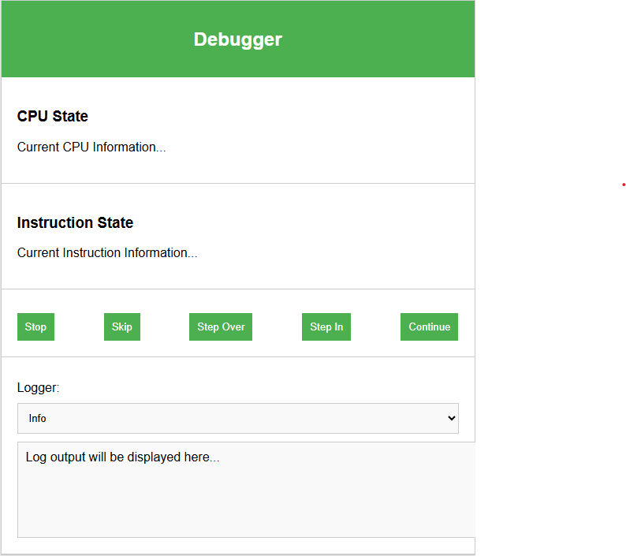

# NES_EMULATOR TODO LIST

### **Step 1: Information to Display**
#### 1.1 Define CPU state information
- Identify the CPU registers, flags, and memory values to display (e.g., `PC`, `A`, `X`, `Y`, `status flags`).
- Implement functions to fetch the current state of the CPU.

#### 1.2 Define Instruction State Information
- Display the currently executing instruction (e.g., opcode, addressing mode, instruction name).
- Implement function to fetch the current instruction being processed.

#### 1.3 UI Controls: Execution Control Buttons
- **Stop Execution Button**
  - Design button layout.
  - Implement a function that pauses the CPU cycle.
  
- **Skip Instruction Button**
  - Design button layout.
  - Implement a function that advances the program counter (PC) by one instruction.

- **Step Over Button**
  - Design button layout.
  - Implement a function to execute the next instruction without stepping into subroutines.

- **Step Into Button**
  - Design button layout.
  - Implement a function to step into subroutines or the next instruction.

- **Finish Execution Button**
  - Design button layout.
  - Implement a function that runs the program until completion.

#### 1.4 Drop-down Logging View
- Decide what kind of logs (e.g., CPU state, memory access, breakpoints) will be shown.
- Implement a function to toggle the visibility of the log.

---

### **Step 2: Debugger Wireframe**
#### 2.1 Design Layout for Each Section
- CPU state section.
- Instruction view section.
- Execution control buttons section.
- Log drop-down section.

---

### **Step 3: Reactivity of Widgets**
For each widget, determine its reactive behavior:

#### 3.1 CPU State Widget
- Trigger state updates when an instruction is executed.
- Update the display with the current CPU state.

#### 3.2 Instruction View Widget
- Update when the current instruction changes.
- Display the new instruction being executed.

#### 3.3 Button Widgets (Stop, Skip, Step Over, Step Into, Finish)
- React to button presses by sending a message to control execution.

#### 3.4 Log Drop-down Widget
- Display or hide logs based on user input (toggle visibility).

---

### **Step 4: Message System**
For each widget, decide how updates and actions are communicated:

#### 4.1 CPU State and Instruction State
- Create messages to fetch the current CPU and instruction state and update the display.

#### 4.2 Button Messages
- **Stop Execution:** Send message to halt CPU.
- **Skip Instruction:** Send message to advance the PC.
- **Step Over:** Send message to execute next instruction but not step into subroutines.
- **Step Into:** Send message to execute next instruction and step into subroutines.
- **Finish Execution:** Send message to run to completion.

#### 4.3 Log Drop-down
- Toggle message to show or hide the log view.

---

### **Widget-Specific TODOs**

- For each button: Design its layout, assign its behavior, and determine the messages it should send.
- For each data display (CPU state, instruction view): Design reactivity, create a way to fetch updated information, and determine when the widget should send or receive updates.

> [wireframe.html](./wireframe.html)

